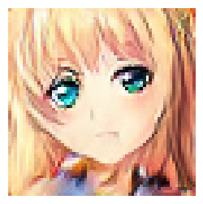

# Anime Face Generation

This repository presents an implementation of a Deep Convolutional Generative Adversarial Network (DCGAN) for generating anime faces. The aim of this project is to generate high-quality anime-style faces with diverse attributes.

## Dataset
The dataset used in this project consists of a collection of 63,374 training images and 2,500 testing images of anime-style faces. The images are provided in PNG format with transparent backgrounds, allowing for seamless integration into various applications and projects.

## Model Architecture
The DCGAN model was implemented using the PyTorch framework. It leverages a deep convolutional neural network to generate anime faces. The architecture comprises a generator and a discriminator network, which work together in an adversarial manner to produce realistic and visually appealing images.

The generator network takes random noise as input and progressively upsamples it to generate increasingly complex features, ultimately producing a realistic anime face. On the other hand, the discriminator network aims to distinguish between the generated anime faces and real anime faces from the dataset. The generator and discriminator networks are trained simultaneously, with the generator striving to generate faces that can fool the discriminator.

## Performance Evaluation
The performance of the model is evaluated in terms of image quality, diversity, and training stability. We rely on the generator loss and discriminator loss as primary metrics to assess the convergence and optimization of the model during training. By monitoring these loss values, we can gain insights into the progress of the training and determine if the model is effectively learning to generate realistic anime faces.

## Results
The results obtained from our DCGAN model showcase high-quality anime faces with diverse attributes. The generated faces exhibit fidelity to the desired anime style, capturing various characteristics commonly observed in anime characters. The model demonstrates its effectiveness in generating visually appealing anime faces that closely resemble real anime faces.

Generated Anime Face

## Usage
To train the DCGAN model on your own dataset, follow the steps below:

- Clone this repository: git clone https://github.com/ADITYAS1000/Anime_Face_Generation.git
- Install the required dependencies: pip install -r requirements.txt
- Start the training process: python train.py
- Monitor the training progress and evaluate the generated images using the provided metrics.

## Conclusion
This repository provides a comprehensive implementation of a DCGAN model for generating anime faces. The generated faces demonstrate high image quality, diversity, and fidelity to the anime style. The results highlight the potential of DCGANs in creating visually appealing and realistic anime faces. This project can be used as a foundation for further research and applications in the field of anime face generation.
